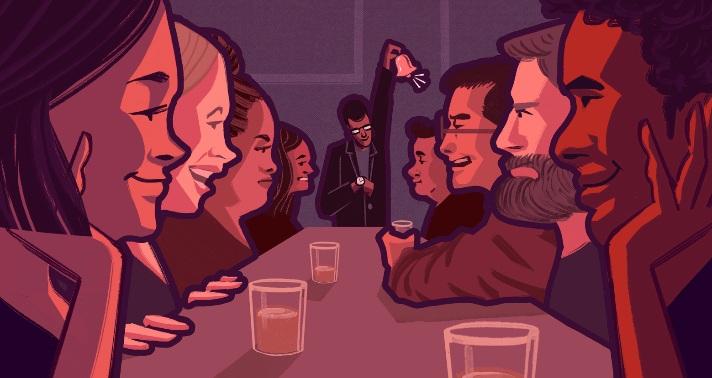

```{r setup, include=FALSE}

knitr::opts_chunk$set(echo = FALSE,warning = FALSE,message = FALSE, fig.align="center")
setwd("~/Github Project R/speed-dating")
library(fmsb)
library(dplyr)
library(tibble)
library(stringr)
library(ggplot2)
library(grid)
library(gridBase)
library(scales)
```


---





###Introduction

<i>What makes people attractive? What is a single person looking in a potential partner? What gets people a second date?</i>
 
####Background


With the advancement in science and technology, the world has changed drastically in last few decades, and so has the dating world. Studies show that dating is more popular than it used to be and it does make sense because the world population is growing at an alarming rate. However, there are various other factors to why dating has become popular than ever these days. People have more choices which makes them believe that they are going to get a better partner. Additionally, dating has become more accessible because of the advancement of technology that has made virtual or online dating possible. As a result, many people have turned to speed dating as a solution to meet and interact with a large number of potential partners in a short amount of time.

In this report, we want to explore what people are looking for in their speed dating matches, what it takes to become successful in getting approvals from a potential partener and what incluences peoples' decisions. In general, what men are looking for in women? What features make men more desirable to women? Are people of same profession compatible or do opposites attract? These are some of the questions that I find interesting and I try to answer them through this data analysis project.
 

####The Data
The data for this project was obtained from the Kaggle website. It was compiled by professors Ray Fisman and Sheena Iyengar from Columbia Business School, originally used for their paper "Gender Differences in Mate Selection: Evidence From a Speed Dating Experiment." It was generated from a series of experimental speed dating events from 2002 to 2004 and includes data related to demographics, dating habits, lifestyle information, an attribute evaluation questionnaire taken when the participants sign up, and each participant's ratings for others during the 4 minute interactions. Finally, individuals were asked if they would like a second date with their partners and rated again on similar questions after the event, when matches have met with each other and dated for several times. Even though the data is more than a decade old, this data should still provide us with some interesting insights to human behavior when it comes to dating. 

Some important data keys that represented each individual in the dates were: IID, ID, Gender, PID, Match, etc. which are described in the data dictionary. We also have information on fields of study, career choice, goals, preferences, interested activities that will help create a profile for each individual and then finally the ratings of their dates that is going to drive our analysis.
 
####Changes to the Data
In several analyses, the participants were given different instructions. For example, in most of the events, participants were given 100 points to distribute to the 6 attributes to show their priority. Some groups, however, were asked to rank the importance of the attributes on a 1-10 scale. Additionally, some participants' scores do not add up to 100. In both cases, the data has been scaled to form a 0-100 distribution like all other participants. There were several people who did not fill out all the information, for instance, 63 people did not fill out fields or 89 people did not fill out careers. Fields were extracted from the field codes. Similarly, there were lots of features that had values missing which had to be removed for proper analysis.
 

---

###What Are Participants Looking For in Their Matches

First, we'd like to see what do the participants in these speed dating events look for in the opposite sex, and if there exist a difference for male and female participants. At this point in time, the participants have just signed up for the event and have not met anyone.

```{r, load data, clean, include = FALSE}

#James Section

#loading data and cleaning

rawdat <- 
read.csv('Speed Dating Data.csv', header = T, stringsAsFactors = F)


#remove variables that will not be used in analysis


dat <- 
rawdat %>% 
  select(-id, -idg, -condtn, -round, -position, -positin1, -order, -partner, -tuition, -undergra, -mn_sat)

```

```{r, data clean, include = FALSE}
#Ratings by other ppl 

at00 <-
dat %>%
  select(iid, pid, dec, gender, attr, sinc, intel, fun, amb, shar, like, prob) %>% 
  filter(!pid == "NA")

#drop rows where all attributes were rated NA (col 4-9)
#Since in the instructions it clearly outlined that not attributes will be discussed during
#the couple's meetings, we cannot do a full NA drop in the data. The workaround here is we will assign all NA values to 1000, and drop the rows if all the attributes add up to 6000. Rows with 1 or 2 NAs will add up to be less than 6000 and will not be dropped. Finally the rows with 1000 will be converted back to NA.

at00[is.na(at00)] <- 1000

at00$total <- rowSums(at00[,c("attr", "sinc", "intel", "fun", "amb", "shar")])

at00 <-
at00 %>% 
  filter(!total == "6000")

at00[at00 == "1000"] <- NA

at00$total <- rowSums(at00[,c("attr", "sinc", "intel", "fun", "amb", "shar")], na.rm=TRUE)

table(at00$total)

#A total of 0 means all entries are 0, which constitutes missing data and row is dropped

at00 <-
at00 %>% 
  filter(!total == "0")

#Finally, it is important to realize that the attributes are evaluated for the opposite gender.
#Another column for the partner is generated

at00 <-
at00 %>% 
  mutate(pgender = ifelse(gender == 0, 1, 0))

```

```{r, Data Clean 2, include = FALSE}
#What are you looking for in your match?

#First, data is checked for consistency since some of the participants will place the ranks differently than others (on a 1-10 scale compared to using a distribution of 100 points). 

#take related attributes with iid and gender into new data frame

at11<-
dat %>%
  group_by(gender) %>%
  select(iid, gender, attr1_1, sinc1_1, intel1_1, fun1_1, amb1_1, shar1_1) %>% 
  unique()

#Next, we would like to turn all NA into 0, but before this, we check if any entries in iid or gender is NA to prevent mislabels

sum(is.na(at11$iid))
sum(is.na(at11$gender))

#Apply command to chnage all NA to 0

at11[is.na(at11)] <- 0

#Add column to check if total of attributions add up to 100

at11$total <- rowSums(at11[,c("attr1_1", "sinc1_1", "intel1_1", "fun1_1", "amb1_1", "shar1_1")])

table(at11$total)

#A total of 0 means all entries are missing and row is dropped

at11<-
at11 %>% 
  filter(!total == "0")

#As there are entry errors in the data, all points are redistributed and curved to fit 100 total points

at11$attr1_1 <- round(at11$attr1_1/at11$total*100, digits = 2)
at11$sinc1_1 <- round(at11$sinc1_1/at11$total*100, digits = 2)
at11$intel1_1 <- round(at11$intel1_1/at11$total*100, digits = 2)
at11$fun1_1 <- round(at11$fun1_1/at11$total*100, digits = 2)
at11$amb1_1 <- round(at11$amb1_1/at11$total*100, digits = 2)
at11$shar1_1 <- round(at11$shar1_1/at11$total*100, digits = 2)

at11$total <- rowSums(at11[,c("attr1_1", "sinc1_1", "intel1_1", "fun1_1", "amb1_1", "shar1_1")])

at11$total <- round(at11$total, digits = 0)
table(at11$total)

```

```{r, what ppl look for, echo = FALSE}

#Next, data is visualized using a radar chart

test1 <-
at11 %>%
  group_by(gender) %>%
  summarise(Attractive = mean(attr1_1), Sincere = mean(sinc1_1), Intelligent = mean(intel1_1), Fun = mean(fun1_1), Ambitious = mean(amb1_1), Interest = mean(shar1_1))

test1forplot <-
test1 %>% 
  select(-gender)
 
maxmin <- data.frame(
 Attractive = c(36, 0),
 Sincere = c(36, 0),
 Intelligent = c(36, 0),
 Fun = c(36, 0),
 Ambitious = c(36, 0),
 Interest = c(36, 0))

test11 <- rbind(maxmin, test1forplot)

test11male <- test11[c(1,2,4),]
test11female <- test11[c(1,2,3),]

radarchart(test11,
           pty = 32,
           axistype = 0,
           pcol = c(adjustcolor("hotpink1", 0.5), adjustcolor("cadetblue2", 0.5)),
           pfcol = c(adjustcolor("hotpink1", 0.5), adjustcolor("cadetblue2", 0.5)),
           plty = 1,
           plwd = 3,
           cglty = 1,
           cglcol = "gray88",
           centerzero = TRUE,
           seg = 5,
           vlcex = 0.75,
           palcex = 0.75)

legend("topleft", 
       c("Male", "Female"),
       fill = c(adjustcolor("cadetblue2", 0.5), adjustcolor("hotpink1", 0.5)))
```

We can see that there is a great difference between what male and female participants are looking for. 

 

 - For male participants, the attractiveness of the female is given a lot more weight, and the ambitiousness or if they have any shared interset are ranked not as high. 

 

 - For females, the points are more evenly distributed across all of the attributes, with intelligence ranked slightly higher compared to others. 

 

####Conlusion

Men are looking for attractive women, and are less concerned with a woman's abmition and shared interests. On the other hand, women are looking for a well-rounded male and value intelligence in a man.

---

###What Paricipants Think Their Same-sex Peers Are Looking For

Next, we want to explore what people think men/women of their same sex is looking for, learn how the participants view their competitors, and determine if they separate their own views from the majority.

```{r, Data Clean 3, include = FALSE}
#same data cleaning
#take related attributes with iid and gender into new data frame

at41<-
dat %>%
  group_by(gender) %>%
  select(iid, gender, attr4_1, sinc4_1, intel4_1, fun4_1, amb4_1, shar4_1) %>% 
  unique()

#Next, we would like to turn all NA into 0, but before this, we check if any entries in iid or gender is NA to prevent mislabels

sum(is.na(at41$iid))
sum(is.na(at41$gender))

#Apply command to chnage all NA to 0

at41[is.na(at41)] <- 0

#Add column to check if total of attributions add up to 100

at41$total <- rowSums(at41[,c("attr4_1", "sinc4_1", "intel4_1", "fun4_1", "amb4_1", "shar4_1")])

table(at41$total)

#A total of 0 means all entries are missing and row is dropped

at41<-
at41 %>% 
  filter(!total == "0")

#As there are entry errors in the data, all points are redistributed and curved to fit 100 total points

at41$attr4_1 <- round(at41$attr4_1/at41$total*100, digits = 2)
at41$sinc4_1 <- round(at41$sinc4_1/at41$total*100, digits = 2)
at41$intel4_1 <- round(at41$intel4_1/at41$total*100, digits = 2)
at41$fun4_1 <- round(at41$fun4_1/at41$total*100, digits = 2)
at41$amb4_1 <- round(at41$amb4_1/at41$total*100, digits = 2)
at41$shar4_1 <- round(at41$shar4_1/at41$total*100, digits = 2)

at41$total <- rowSums(at41[,c("attr4_1", "sinc4_1", "intel4_1", "fun4_1", "amb4_1", "shar4_1")])

at41$total <- round(at41$total, digits = 0)
table(at41$total)

```

```{r, what ppl think same gender look for, echo = FALSE}
#Next, data is visualized using a radar chart, what do you think most of your fellow men/women are looking for

test4 <-
at41 %>%
  group_by(gender) %>%
  summarise(Attractive = mean(attr4_1), Sincere = mean(sinc4_1), Intelligent = mean(intel4_1), Fun = mean(fun4_1), Ambitious = mean(amb4_1), Interest = mean(shar4_1))

test4forplot <-
test4 %>% 
  select(-gender)

test41 <- rbind(maxmin, test4forplot)

radarchart(test41,
           pty = 32,
           axistype = 0,
           pcol = c(adjustcolor("hotpink1", 0.5), adjustcolor("cadetblue2", 0.5)),
           pfcol = c(adjustcolor("hotpink1", 0.5), adjustcolor("cadetblue2", 0.5)),
           plty = 1,
           plwd = 3,
           cglty = 1,
           cglcol = "gray88",
           centerzero = TRUE,
           seg = 5,
           vlcex = 0.75,
           palcex = 0.75)

legend("topleft", 
       c("Male", "Female"),
       fill = c(adjustcolor("cadetblue2", 0.5), adjustcolor("hotpink1", 0.5)))

```

As we can see in the graph, both men and women think people of their same gender are most concerned with finding an attractive partner.

- Similar to the previous analysis, men think their fellow mates highly value attractiveness and are less concerned with a woman's ambition.

- In contrast, there exist a significant difference in women's answers in comparison to the presvious analysis. Women say that they themselves are looking for a well rounded man and attractiveness is not necessarily important. However, they think that other women are mainly looking for attractive and ambitious men.

 

####Conlusion

Both men and women think that their competitors are looking for attractive counterparts, and what women say they are looking for is drastically different from what other women think their peers value.

---

###What Do Participants Think the Opposite Sex is Looking For

Finally, we analyze what participants think their opposite sex is looking for. We will able to see if there are any difference in the expectations of men and women with regards to the speed dating event.

```{r, Data Clean, include = FALSE}

#take related attributes with iid and gender into new data frame

at21<-
dat %>%
  group_by(gender) %>%
  select(iid, gender, attr2_1, sinc2_1, intel2_1, fun2_1, amb2_1, shar2_1) %>% 
  unique()

#Next, we would like to turn all NA into 0, but before this, we check if any entries in iid or gender is NA to prevent mislabels

sum(is.na(at21$iid))
sum(is.na(at21$gender))

#Apply command to chnage all NA to 0

at21[is.na(at21)] <- 0

#Add column to check if total of attributions add up to 100

at21$total <- rowSums(at21[,c("attr2_1", "sinc2_1", "intel2_1", "fun2_1", "amb2_1", "shar2_1")])

table(at21$total)

#A total of 0 means all entries are missing and row is dropped

at21<-
at21 %>% 
  filter(!total == "0")

#As there are entry errors in the data, all points are redistributed and curved to fit 100 total points

at21$attr2_1 <- round(at21$attr2_1/at21$total*100, digits = 2)
at21$sinc2_1 <- round(at21$sinc2_1/at21$total*100, digits = 2)
at21$intel2_1 <- round(at21$intel2_1/at21$total*100, digits = 2)
at21$fun2_1 <- round(at21$fun2_1/at21$total*100, digits = 2)
at21$amb2_1 <- round(at21$amb2_1/at21$total*100, digits = 2)
at21$shar2_1 <- round(at21$shar2_1/at21$total*100, digits = 2)

at21$total <- rowSums(at21[,c("attr2_1", "sinc2_1", "intel2_1", "fun2_1", "amb2_1", "shar2_1")])

at21$total <- round(at21$total, digits = 0)
table(at21$total)

```

```{r, what do ppl think opposite sex look for, echo = FALSE}

#Next, data is visualized using a radar chart, what do you think most of your fellow men/women are looking for

test2 <-
at21 %>%
  group_by(gender) %>%
  summarise(Attractive = mean(attr2_1), Sincere = mean(sinc2_1), Intelligent = mean(intel2_1), Fun = mean(fun2_1), Ambitious = mean(amb2_1), Interest = mean(shar2_1))

test2forplot <-
test2 %>% 
  select(-gender)

test21 <- rbind(maxmin, test2forplot)

radarchart(test21,
           pty = 32,
           axistype = 0,
           pcol = c(adjustcolor("hotpink1", 0.5), adjustcolor("cadetblue2", 0.5)),
           pfcol = c(adjustcolor("hotpink1", 0.5), adjustcolor("cadetblue2", 0.5)),
           plty = 1,
           plwd = 3,
           cglty = 1,
           cglcol = "gray88",
           centerzero = TRUE,
           seg = 5,
           vlcex = 0.75,
           palcex = 0.75)

legend("topleft", 
       c("Male", "Female"),
       fill = c(adjustcolor("cadetblue2", 0.5), adjustcolor("hotpink1", 0.5)))
```

```{r, Compiled graphing, distribution, not shown, include = FALSE}

vp1 <- viewport(x = 0, y = 0.5, width = 0.5, height = 0.5, just = c("left", "bottom"))
vp2 <- viewport(x = 0.5, y = 0.5, width = 0.5, height = 0.5, just = c("left", "bottom"))
vp3 <- viewport(x = 0, y = 0, width = 0.5, height = 0.5, just = c("left", "bottom"))
vp4 <- viewport(x = 0.5, y = 0, width = 0.5, height = 0.5, just = c("left", "bottom"))

plot.new() 

pushViewport(vp1)

par(new=TRUE, 
    fig=gridFIG(),
    mar=c(0.01, 0.01, 0.01, 0.01))

radarchart(test11,
           pty = 32,
           axistype = 0,
           pcol = c(adjustcolor("hotpink1", 0.5), adjustcolor("cadetblue2", 0.5)),
           pfcol = c(adjustcolor("hotpink1", 0.5), adjustcolor("cadetblue2", 0.5)),
           plty = 1,
           plwd = 3,
           cglty = 1,
           cglcol = "gray88",
           centerzero = TRUE,
           seg = 5,
           vlcex = 0.75,
           palcex = 0.75)

grid.text("(a)", x=0.1, y=0.9)

popViewport()

pushViewport(vp2)

par(new=TRUE, 
    fig=gridFIG(),
    mar=c(0.01, 0.01, 0.01, 0.01))

radarchart(test41,
           pty = 32,
           axistype = 0,
           pcol = c(adjustcolor("hotpink1", 0.5), adjustcolor("cadetblue2", 0.5)),
           pfcol = c(adjustcolor("hotpink1", 0.5), adjustcolor("cadetblue2", 0.5)),
           plty = 1,
           plwd = 3,
           cglty = 1,
           cglcol = "gray88",
           centerzero = TRUE,
           seg = 5,
           vlcex = 0.75,
           palcex = 0.75)

grid.text("(b)", x=0.1, y=0.9)

popViewport()

pushViewport(vp3)

par(new=TRUE, 
    fig=gridFIG(),
    mar=c(0.01, 0.01, 0.01, 0.01))

radarchart(test21,
           pty = 32,
           axistype = 0,
           pcol = c(adjustcolor("hotpink1", 0.5), adjustcolor("cadetblue2", 0.5)),
           pfcol = c(adjustcolor("hotpink1", 0.5), adjustcolor("cadetblue2", 0.5)),
           plty = 1,
           plwd = 3,
           cglty = 1,
           cglcol = "gray88",
           centerzero = TRUE,
           seg = 5,
           vlcex = 0.75,
           palcex = 0.75)

grid.text("(c)", x=0.1, y=0.9)

popViewport()

pushViewport(vp4)

grid.text("(a) What attributes are people looking for",
          x = 0.1,
          y = 0.5,
          gp = gpar(fontsize = 10),
          just = c("left", "bottom"))

grid.text("(b) What do people think their fellow 
      men/women are looking for",
          x=0.1,
          y=0.27,
          gp = gpar(fontsize = 10),
          just = c("left", "bottom"))

grid.text("(c) What do people think the opposite 
      sex are looking for",
          x=0.1,
          y=0.04,
          gp = gpar(fontsize = 10),
          just = c("left", "bottom"))

legend(x = 2.3, y = 1, c("Male", "Female"),
fill = c(adjustcolor("cadetblue2", 0.5), adjustcolor("hotpink1", 0.5)))

popViewport()

```

- Women strongly feel that men are most concerned with a woman's attractiveness and that other attributes are not as important, especially ambitiousness. 

- Comapring female and male answers in the first graph, we can see that there are not that much difference between the two. We can say that women almost accurately predicted what men are looking for in their partners (i.e. attractiveness). 

- Additionally, men's predictions were not far off either. By comparing males' responses here and female's responses in the first graph, what men think women are looking for also closely resembles what women say they are looking for. The main differences, though, are a higher attractiveness score and a lower shared interest score. 


####Conclusion

Both men and women can predict what the opposite sex are looking for in their partners to a certain degree.


We must note that all of the answers here are based on a survey conducted before the actual speed dating event. The responses provided are based on what people "say" they want, and we will compare this with the next analysis to see if people's decisions are consistent with their answers.

---

##Which of the 6 Attributes Actually Influence Decision Making?

During all events, each person will be able to meet with an average of 12 people of the other sex and have 4 minutes to talk with them. After that, they will rate their partners on the previous 6 attributions and indicate if they are interested in meeting with that person again.


Here, we aim to discover which attributes are most important in getting a positive response from their partners. 


On the x-axis, we calculate how many positive responses can a person get from the opposite sex. For example, if a man met with 10 women and 6 of them indicated that they would like to meet him again, his positive response rate would be 60%. On the y-axis, we averaged the scores in the 6 attributes that the man received from the 10 women. 


Finally, the Pearson Product-Moment Correlation Coefficient (R score) is calculated for each of the attributes to show how strong the correlation is between the positive response rate and the score of the attributes.

---

###Influence of Attributes to Match Making

```{r, Data organization, include = FALSE}

test2 <-
at00 %>%
  group_by(pid, pgender) %>%
  summarise(Decision = mean(dec), Attractive = mean(attr), Sincere = mean(sinc), Intelligent = mean(intel), Fun = mean(fun), Ambitious = mean(amb), Interest = mean(shar))

test2a <-
test2 %>% 
  select(pid, pgender, Decision, Attractive) %>% 
  filter(!Attractive == "NA")

test2b <-
test2 %>% 
  select(pid, pgender, Decision, Sincere) %>% 
  filter(!Sincere == "NA")

test2c <-
test2 %>% 
  select(pid, pgender, Decision, Intelligent) %>% 
  filter(!Intelligent == "NA")

test2d <-
test2 %>% 
  select(pid, pgender, Decision, Fun) %>% 
  filter(!Fun == "NA")

test2e <-
test2 %>% 
  select(pid, pgender, Decision, Ambitious) %>% 
  filter(!Ambitious == "NA")

test2f <-
test2 %>% 
  select(pid, pgender, Decision, Interest) %>% 
  filter(!Interest == "NA")

coratr <- cor(test2a$Decision, test2a$Attractive)
corsin <- cor(test2b$Decision, test2b$Sincere)
corint <- cor(test2c$Decision, test2c$Intelligent)
corfun <- cor(test2d$Decision, test2d$Fun)
coramb <- cor(test2e$Decision, test2e$Ambitious)
corshar <- cor(test2f$Decision, test2f$Interest)

```

```{r, attribute correlation, echo = FALSE}

vp8 <- viewport(x = 0, y = 0.45, width = 1/3, height = 0.45, just = c("left", "bottom"))
vp9 <- viewport(x = 1/3, y = 0.45, width = 1/3, height = 0.45, just = c("left", "bottom"))
vp10 <- viewport(x = 2/3, y = 0.45, width = 1/3, height = 0.45, just = c("left", "bottom"))
vp11 <- viewport(x = 0, y = 0, width = 1/3, height = 0.45, just = c("left", "bottom"))
vp12 <- viewport(x = 1/3, y = 0, width = 1/3, height = 0.45, just = c("left", "bottom"))
vp13 <- viewport(x = 2/3, y = 0, width = 1/3, height = 0.45, just = c("left", "bottom"))
vp14 <- viewport(x = 0, y = 0.9, width = 1, height = 0.1, just = c("left", "bottom"))

graphattr <-
test2a %>% 
  ggplot() +
  aes(x = Decision, y = Attractive) +
  geom_point(alpha = 0.1) +
  theme(panel.background = element_blank()) +
  geom_smooth(method = lm,
                se = FALSE, 
                size = 1.5) +
  labs(x="Positive Response Rate",
       y="Attractiveness Score") +
  scale_y_continuous(breaks = c(0, 5, 10), limits = c(0, 10)) +
  scale_x_continuous(limits = c(0, 1), breaks = c(0, 0.5, 1), labels = percent) +
  annotate("text", x = 0.05, y = 10, label = "(a)") +
  annotate("text", x = 0.8, y = 1, label = "R = 0.795")

graphsinc <-
test2b %>% 
  ggplot() +
  aes(x = Decision, y = Sincere) +
  geom_point(alpha = 0.1) +
  theme(panel.background = element_blank()) +
  geom_smooth(method = lm,
                size = 1.5,
                se = FALSE) +
  labs(x="Positive Response Rate",
       y="Sincerity Score") +
  scale_y_continuous(breaks = c(0, 5, 10), limits = c(0, 10)) +
  scale_x_continuous(limits = c(0, 1), breaks = c(0, 0.5, 1), labels = percent) +
  annotate("text", x = 0.05, y = 10, label = "(b)") +
  annotate("text", x = 0.8, y = 1, label = "R = 0.258")

graphintel <-
test2c %>% 
  ggplot() +
  aes(x = Decision, y = Intelligent) +
  geom_point(alpha = 0.1) +
  theme(panel.background = element_blank()) +
  geom_smooth(method = lm,
                size = 1.5,
                se = FALSE) +
  labs(x="Positive Response Rate",
       y="Intelligence Score") +
  scale_y_continuous(breaks = c(0, 5, 10), limits = c(0, 10)) +
  scale_x_continuous(limits = c(0, 1), breaks = c(0, 0.5, 1), labels = percent) +
  annotate("text", x = 0.05, y=10, label = "(c)") +
  annotate("text", x = 0.8, y = 1, label = "R = 0.286")

graphfun <-
test2d %>% 
  ggplot() +
  aes(x = Decision, y = Fun) +
  geom_point(alpha = 0.1) +
  theme(panel.background = element_blank()) +
  geom_smooth(method = lm,
                size = 1.5,
                se = FALSE) +
  labs(x="Positive Response Rate",
       y="Fun Score") +
  scale_y_continuous(breaks = c(0, 5, 10), limits = c(0, 10)) +
  scale_x_continuous(limits = c(0, 1), breaks = c(0, 0.5, 1), labels = percent) +
  annotate("text", x = 0.05, y=10, label = "(d)") +
  annotate("text", x = 0.8, y = 1, label = "R = 0.674")

graphamb <-
test2e %>% 
  ggplot() +
  aes(x = Decision, y = Ambitious) +
  geom_point(alpha = 0.1) +
  theme(panel.background = element_blank()) +
  geom_smooth(method = lm,
                size = 1.5,
                se = FALSE) +
  labs(x="Positive Response Rate",
       y="Ambitious Score") +
  scale_y_continuous(breaks = c(0, 5, 10), limits = c(0, 10)) +
  scale_x_continuous(limits = c(0, 1), breaks = c(0, 0.5, 1), labels = percent) +
  annotate("text", x = 0.05, y = 10, label = "(e)") +
  annotate("text", x = 0.8, y = 1, label = "R = 0.249")

graphshar <-
test2f %>% 
  ggplot() +
  aes(x = Decision, y = Interest) +
  geom_point(alpha = 0.1) +
  theme(panel.background = element_blank()) +
  geom_smooth(method = lm,
                size = 1.5,
                se = FALSE) +
  labs(x="Positive Response Rate",
       y="Interest Score") +
  scale_y_continuous(breaks = c(0, 5, 10), limits = c(0, 10)) +
  scale_x_continuous(limits = c(0, 1), breaks = c(0, 0.5, 1), labels = percent) +
  annotate("text", x = 0.05, y = 10, label = "(f)") +
  annotate("text", x = 0.8, y = 1, label = "R = 0.667")

print(graphattr, vp = vp8)
print(graphsinc, vp = vp9)
print(graphintel, vp = vp10)
print(graphfun, vp = vp11)
print(graphamb, vp = vp12)
print(graphshar, vp = vp13)

```

- As we can see from the graph and correlation score, the most important attribute is attractiveness of the individual, followed by how fun the individual is and if the two people have any shared interest. 

 

- In contrast, being sincere, being intelligent, and being ambitious would not necessarily get that person a higher positive response rate. A person could have a high rating for sincerity, intelligence, and ambition, however this would not necessary correspond with a highly positive response rate.

 

It's worth noting that the amount of data available is different for each of the attributes. Since the participants only have 4 minutes to talk with their partners, they may not have sufficient information to judge on all 6 attributes. The participants were instructed to put in NA if he/she is not able to judge on that attribute, resulting in the different number of responses available for each attribute.

 

####Conclusion

 

Imporance of the attributes ranked high to low: Attractive, Fun, Shared Interest, Intelligent, Sincere, and Ambitious.

 

Next, we would like to see if there are any differences in the correlation scores between male and female.

---

###Breakdown of Correlation Coefficient Score into Male and Female

```{r, data organization, include = FALSE}

test2am <-
test2 %>% 
  select(pid, pgender, Decision, Attractive) %>% 
  filter(!Attractive == "NA") %>% 
  filter(pgender == "1")

test2af <-
test2 %>% 
  select(pid, pgender, Decision, Attractive) %>% 
  filter(!Attractive == "NA") %>% 
  filter(pgender == "0")

cormatr <- cor(test2am$Decision, test2am$Attractive)
corfatr <- cor(test2af$Decision, test2af$Attractive)

test2bm <-
test2 %>% 
  select(pid, pgender, Decision, Sincere) %>% 
  filter(!Sincere == "NA") %>% 
  filter(pgender == "1")

test2bf <-
test2 %>% 
  select(pid, pgender, Decision, Sincere) %>% 
  filter(!Sincere == "NA") %>% 
  filter(pgender == "0")
  
cormsin <- cor(test2bm$Decision, test2bm$Sincere)
corfsin <- cor(test2bf$Decision, test2bf$Sincere)

test2cm <-
test2 %>% 
  select(pid, pgender, Decision, Intelligent) %>% 
  filter(!Intelligent == "NA") %>% 
  filter(pgender == "1")

test2cf <-
test2 %>% 
  select(pid, pgender, Decision, Intelligent) %>% 
  filter(!Intelligent == "NA") %>% 
  filter(pgender == "0")

cormint <- cor(test2cm$Decision, test2cm$Intelligent)
corfint <- cor(test2cf$Decision, test2cf$Intelligent)

corint

test2dm <-
test2 %>% 
  select(pid, pgender, Decision, Fun) %>% 
  filter(!Fun == "NA") %>% 
  filter(pgender == "1")

test2df <-
test2 %>% 
  select(pid, pgender, Decision, Fun) %>% 
  filter(!Fun == "NA") %>% 
  filter(pgender == "0")

cormfun <- cor(test2dm$Decision, test2dm$Fun)
corffun <- cor(test2df$Decision, test2df$Fun)

test2em <-
test2 %>% 
  select(pid, pgender, Decision, Ambitious) %>% 
  filter(!Ambitious == "NA") %>% 
  filter(pgender == "1")

test2ef <-
test2 %>% 
  select(pid, pgender, Decision, Ambitious) %>% 
  filter(!Ambitious == "NA") %>% 
  filter(pgender == "0")

cormamb <- cor(test2em$Decision, test2em$Ambitious)
corfamb <- cor(test2ef$Decision, test2ef$Ambitious)

test2fm <-
test2 %>% 
  select(pid, pgender, Decision, Interest) %>% 
  filter(!Interest == "NA") %>% 
  filter(pgender == "1")

test2ff <-
test2 %>% 
  select(pid, pgender, Decision, Interest) %>% 
  filter(!Interest == "NA") %>% 
  filter(pgender == "0")

cormshar <- cor(test2fm$Decision, test2fm$Interest)
corfshar <- cor(test2ff$Decision, test2ff$Interest)

```

```{r, male/female attr correlation, echo = FALSE}


corforgraph2 <-data.frame(Traits = c("Average", "Male", "Female"),
                          corAttractive = c(coratr, cormatr, corfatr),
                          corSincere = c(corsin, cormsin, corfsin),
                          corIntelligence = c(corint, cormint, corfint),
                          corFun = c(corfun, cormfun, corffun),
                          corAmbitious = c(coramb, cormamb, corfamb),
                          corInterest = c(corshar, cormshar, corfshar))

gcorAttractive <-
corforgraph2 %>% 
  ggplot() +
  aes(x = Traits, y = corAttractive, fill = Traits) +
  geom_bar(stat = "Identity", width = 0.8, fill = c("gray55", "cadetblue2", "hotpink1")) +
  theme(panel.grid.major = element_blank(),
        panel.grid.minor = element_blank(),
        panel.background = element_rect(fill = "gray96"),
        axis.title.x=element_blank()) +
  labs(y = "Correlation") +
  scale_y_continuous(breaks = c(0, 0.5), limits = c(0, 1)) +
  scale_x_discrete(limits=c("Average","Male","Female"),
                   labels = c("Ave","M","F")) +
  annotate("text", x = 0.6, y = 0.99, label = "(a) Attractiveness", hjust = 0, size = 3) +
  geom_text(aes(label = round(corAttractive, digits=3)),
          nudge_y = 0.05,
          size = 2.5,
          color="black")

gcorSincere <-
corforgraph2 %>% 
  ggplot() +
  aes(x = Traits, y = corSincere) +
  geom_bar(stat = "Identity", width = 0.8, fill = c("gray55", "cadetblue2", "hotpink1")) +
  theme(panel.grid.major = element_blank(),
        panel.grid.minor = element_blank(),
        panel.background = element_rect(fill = "gray96"),
        axis.title.x=element_blank()) +
  labs(y = "Correlation") +
  scale_y_continuous(breaks = c(0, 0.5), limits = c(0, 1)) +
  scale_x_discrete(limits=c("Average","Male","Female"),
                   labels = c("Ave","M","F")) +
  annotate("text", x = 0.6, y = 0.99, label = "(b) Sincerity", hjust = 0, size = 3) +
  geom_text(aes(label = round(corSincere, digits=3)),
          nudge_y = 0.05,
          size = 2.5,
          color="black")

gcorIntelligence <-
corforgraph2 %>% 
  ggplot() +
  aes(x = Traits, y = corIntelligence) +
  geom_bar(stat = "Identity", width = 0.8, fill = c("gray55", "cadetblue2", "hotpink1")) +
  theme(panel.grid.major = element_blank(),
        panel.grid.minor = element_blank(),
        panel.background = element_rect(fill = "gray96"),
        axis.title.x=element_blank()) +
  labs(y = "Correlation") +
  scale_y_continuous(breaks = c(0, 0.5), limits = c(0, 1)) +
  scale_x_discrete(limits=c("Average","Male","Female"),
                   labels = c("Ave","M","F")) +
  annotate("text", x = 0.6, y = 0.99, label = "(c) Intelligence", hjust = 0, size = 3) +
  geom_text(aes(label = round(corIntelligence, digits=3)),
          nudge_y = 0.05,
          size = 2.5,
          color="black")

gcorFun <-
corforgraph2 %>% 
  ggplot() +
  aes(x = Traits, y = corFun) +
  geom_bar(stat = "Identity", width = 0.8, fill = c("gray55", "cadetblue2", "hotpink1")) +
  theme(panel.grid.major = element_blank(),
        panel.grid.minor = element_blank(),
        panel.background = element_rect(fill = "gray96"),
        axis.title.x=element_blank()) +
  labs(y = "Correlation") +
  scale_y_continuous(breaks = c(0, 0.5), limits = c(0, 1)) +
  scale_x_discrete(limits=c("Average","Male","Female"),
                   labels = c("Ave","M","F")) +
  annotate("text", x = 0.6, y = 0.99, label = "(d) Fun", hjust = 0, size = 3) +
  geom_text(aes(label = round(corFun, digits=3)),
          nudge_y = 0.05,
          size = 2.5,
          color="black")

gcorAmbitious <-
corforgraph2 %>% 
  ggplot() +
  aes(x = Traits, y = corAmbitious) +
  geom_bar(stat = "Identity", width = 0.8, fill = c("gray55", "cadetblue2", "hotpink1")) +
  theme(panel.grid.major = element_blank(),
        panel.grid.minor = element_blank(),
        panel.background = element_rect(fill = "gray96"),
        axis.title.x=element_blank()) +
  labs(y = "Correlation") +
  scale_y_continuous(breaks = c(0, 0.5), limits = c(0, 1)) +
  scale_x_discrete(limits=c("Average","Male","Female"),
                   labels = c("Ave","M","F")) +
  annotate("text", x = 0.6, y = 0.99, label = "(e) Ambitious", hjust = 0, size = 3) +
  geom_text(aes(label = round(corAmbitious, digits=3)),
          nudge_y = 0.05,
          size = 2.5,
          color="black")

gcorInterest <-
corforgraph2 %>% 
  ggplot() +
  aes(x = Traits, y = corInterest) +
  geom_bar(stat = "Identity", width = 0.8, fill = c("gray55", "cadetblue2", "hotpink1")) +
  theme(panel.grid.major = element_blank(),
        panel.grid.minor = element_blank(),
        panel.background = element_rect(fill = "gray96"),
        axis.title.x=element_blank()) +
  labs(y = "Correlation") +
  scale_y_continuous(breaks = c(0, 0.5), limits = c(0, 1)) +
  scale_x_discrete(limits=c("Average","Male","Female"),
                   labels = c("Ave","M","F")) +
  annotate("text", x = 0.6, y = 0.99, label = "(f) Shared Interest", hjust = 0, size = 3) +
  geom_text(aes(label = round(corInterest, digits=3)),
          nudge_y = 0.05,
          size = 2.5,
          color="black")

print(gcorAttractive, vp = vp8)
print(gcorSincere, vp = vp9)
print(gcorIntelligence, vp = vp10)
print(gcorFun, vp = vp11)
print(gcorAmbitious, vp = vp12)
print(gcorInterest, vp = vp13)

pushViewport(vp14)

grid.text("Correlation Difference in Males and Females",
          x = 0.5,
          y = 0.5,
          gp = gpar(fontsize = 16),
          just = c("center", "center"))

popViewport()

```

Correlation data is further divided into male and female decisions, and correlation scores are again calculated. 

 

####Conclusions

(a) No significant difference between male and female on attractiveness scores.

(b) A sincere male would win slightly more positive responses compared to a sincere female.

(c) An intelligent female would win more positive responses compared to an intelligent male.

(d) No significant difference between male and female on fun scores.

(e) An ambitious female is highly desirable by males and not so much vice versa, although ambitiousness still do not rank as high as attractive, fun, and shared interest.

(f) Females are more likely to give out a positive reponses if the male has shared interest with her. In contrast, males are not so likely to give out a positive reponse even if the female has shared interest with him.

This data will be compared with the first graph to see if people really know what they want.

---

###Other Factors that may influence people's decisions

####The Order of meeting your partner

In this section, we analyze if the order you met the opposite sex will have an influence on whether or not you would like to go on a second date with them.

```{r, include = FALSE}

#Lucas Section

dat = read.csv('Speed Dating Data.csv', header = TRUE)

#Add new column with order of date divided by number of people in round
dat$ordernorm = dat$order/dat$round
orderPercentiles = sort(unique(dat$ordernorm))

#Group by column above and find mean acceptance
datgroup =aggregate(dat$dec,by=list(dat$ordernorm),FUN=mean)
scatterplot = plot(datgroup$Group.1,datgroup$x,ylab="percent who decided yes",xlab = "order/numberOfRounds")

#Group by wave and find max of "order" column
#Doing this incase rounds aren't fully finished and order=round isnt true indicator of whether date was last
datmax = aggregate(dat$order,by=list(dat$wave),FUN=max)

#Add column with maximum of "order" from that wave
dat = merge(dat,datmax,by.x="wave",by.y="Group.1")
colnames(dat)[colnames(dat)=="x"] <- "maxWaveOrder"

#Binary column added -- is this last encounter of session?
dat$last = ifelse(dat$order==dat$maxWaveOrder,1,0)

#Subset data to rows where order is first/last
datfirst = subset(dat,dat$order==1)
datlast = subset(dat,dat$last==1)

#Find mean decision
firstMean=mean(datfirst$dec)
lastMean=mean(datlast$dec)


dfFirstLast = data.frame(c("First","Last"),c(firstMean,lastMean))

#Name Columns
colnames(dfFirstLast)[colnames(dfFirstLast)=="c..First....Last.."] <- "Order"
colnames(dfFirstLast)[colnames(dfFirstLast)=="c.firstMean..lastMean."] <- "percentAccepted"


```

```{r, echo = FALSE, warning = FALSE, graphing}

#Plot
ggplot(dfFirstLast,aes(x=dfFirstLast$Order,y=100*dfFirstLast$percentAccepted, fill = dfFirstLast$Order))+
  geom_bar(stat="identity")+
  scale_fill_manual(values = c("#0F3D40", "#3BF6FF"))+
  guides(fill=guide_legend(title=NULL))+
  ggtitle("Percent of Time Person Asks For Second Date")+
  xlab("Order")+
  ylab("Percent")+
  geom_text(aes(label=paste(round(100*dfFirstLast$percentAccepted,digits=2),"%")),nudge_y = 1.5,color="Black", size=5)
  

```

As shown in the plot, there's a noticeable difference in the frequency of a person requesting a second date depending on whether it's the individual's first date of the night or last. For their first date, participants requested a second date almost exactly half the time. For their final date of the night, that number dips to 45%. 

This could be attributed to a number of different reasons, one of which being the likelihood that participants are socially burnt out by the end of the night (leading to less engaging conversation). Additionally, participants could be less likely to request second dates at the end of the night simply because by this point, they've already found other options they're happy with. 

While this plot is revealing, it only deals with the very first and last date. The next investigation will seek to obtain a more complete picture on how the likelihood of a participant to request a second date changes as the rounds progress.  

---

###Detailed Analysis of How Order Influence Decision Making

Now, we analyze all the rounds and see if round order have an impact to getting a second date.

Because speed-dating waves contain varying numbers of total cycles, it's misleading to look simply at what number cycle the date is on. The 10th date could be the final round for a given wave but the middle round for a longer wave. Thus, dividing the order of the date by the total number of dates in the wave adjusts for this inconsistency.

```{r, include = FALSE}
#Add column with bucket for order/number of dates ratio   
dat$orderBucket = ifelse(dat$ordernorm <= .1,"0-0.1",ifelse(dat$ordernorm > .1 & dat$ordernorm < .4,"0.1-0.4",ifelse(dat$ordernorm >= .4 & dat$ordernorm <= .6,"0.4-0.6",ifelse(dat$ordernorm > .6 & dat$ordernorm < .9,"0.6-0.9",  ifelse(dat$ordernorm > .9,"0.9-1",NA)))))

#Find mean decision for each bucket
orderAvg= aggregate(dat$dec,by=list(dat$orderBucket),FUN=mean)

#Order the levels
desired_order <- c("0-0.1","0.1-0.4","0.4-0.6","0.6-0.9","0.9-1")
orderAvg = orderAvg[match(desired_order,orderAvg$Group.1),]
orderAvg$Group.1 = factor(orderAvg$Group.1,levels=unique(orderAvg$Group.1))
```

```{r, echo = FALSE, warning = FALSE}
colours <- c("#0F3D40", "#1D7B7F", "#2CB8BF", "#35DDE5", "#3BF6FF")

#Plot
ggplot(orderAvg,aes(x=orderAvg$Group.1,y=x,group=1, fill = orderAvg$Group))+
  geom_bar(stat = "identity")+
  coord_cartesian(ylim=c(0.35,0.5))+
  scale_fill_manual(values = colours)+
  guides(fill=guide_legend(title=NULL))+
  ggtitle(paste("Percent of Time Person Asks For Second Date,", "\n","Grouped By (Order of Date)/(Number of Dates in Round)"))+
  xlab("Order of Date/Number of Dates in Round")+
  ylab("percent")+
  geom_text(aes(label=paste(round(100*x,digits=2),"%")),nudge_y = 0.005,color="black")
  

#orderAvg
```

The results of this plot indicate that the middle rounds contain the lowest percentage of requests for 2nd dates. There are a few possible explanations for these results. Dates that occur towards the beginning of the night are more likely to lead to second dates for two reasons: participants aren't socially worn down yet, and they haven't requested many other dates at this point. As participants enter the middle waves, they are less likely to request more dates because they've already requested dates with other people. Additionally, it's likely more difficult to have engaging, interesting dialogue when it's your 5th or 6th conversation of the night. Consequently, duller conversations could lead to lower request rates.
 
Request rates do, however, increase towards the very final rounds of the event. One possible explanation for this is that participants who haven't been thrilled with their dates feel more pressure to find matches. With a dwindling number of dates remaining, they may feel more desperate to ask for second dates knowing they don't have much time left in the event.

---

###Male/Female's Stated Interest Compared to Actual Influence on Decision

Finally, we would like to see if people really know what they want. At the beginning, people stated their desired traits and put a score based on their stated importance. Males value attractiveness and don't value ambitiousnes. Females desire a well-rounded male, with intelligence ranked slightly higher. We took the correlation score from the last 2 sections and scaled it proportionally to total 100 points, just as we did in previous cases, to see how males and females actually view these traits. 

```{r, data organization n, include = FALSE}
#James Section
#rename for easier data manipulation
fin <- corforgraph2

fin$total <- rowSums(fin[,c("corAttractive", "corSincere", "corIntelligence", "corFun", "corAmbitious", "corInterest")])

fin$corAttractive <- round(fin$corAttractive/fin$total*100, digits = 2)
fin$corSincere <- round(fin$corSincere/fin$total*100, digits = 2)
fin$corIntelligence <- round(fin$corIntelligence/fin$total*100, digits = 2)
fin$corFun <- round(fin$corFun/fin$total*100, digits = 2)
fin$corAmbitious <- round(fin$corAmbitious/fin$total*100, digits = 2)
fin$corInterest <- round(fin$corInterest/fin$total*100, digits = 2)

fin <-
fin %>% 
  select(corAttractive, corSincere, corIntelligence, corFun, corAmbitious, corInterest)

colnames(fin) <- c("Attractive","Sincere", "Intelligent", "Fun", "Ambitious", "Interest")


testn <- rbind(maxmin, fin, test1forplot)

testnmale <- testn[-c(3, 4, 6), ]
testnfemale <- testn[-c(3, 5, 7), ] 

radarchart(testnmale,
           pty = 32,
           axistype = 0,
           pcol = c(adjustcolor("chartreuse1", 0.5), adjustcolor("cadetblue2", 0.5)),
           pfcol = c(adjustcolor("chartreuse1", 0.5), adjustcolor("cadetblue2", 0.5)),
           plty = 1,
           plwd = 3,
           cglty = 1,
           cglcol = "gray88",
           centerzero = TRUE,
           seg = 5,
           vlcex = 0.75,
           palcex = 0.75,
           title = "Male's Stated Interest Compared to Actual Influence on Decision")

legend("topleft", 
       c("Stated Interest", "Actual Influence"),
       fill = c(adjustcolor("cadetblue2", 0.5), adjustcolor("chartreuse1", 0.5)))

radarchart(testnfemale,
           pty = 32,
           axistype = 0,
           pcol = c(adjustcolor("darkorchid1", 0.5), adjustcolor("hotpink1", 0.5)),
           pfcol = c(adjustcolor("darkorchid1", 0.5), adjustcolor("hotpink1", 0.5)),
           plty = 1,
           plwd = 3,
           cglty = 1,
           cglcol = "gray88",
           centerzero = TRUE,
           seg = 5,
           vlcex = 0.75,
           palcex = 0.75,
           title = "Female's Stated Interest Compared to Actual Influence on Decision")

legend("topleft", 
       c("Stated Interest", "Actual Influence"),
       fill = c(adjustcolor("hotpink1", 0.5), adjustcolor("darkorchid1", 0.5)))


```

```{r, final graphing, echo = FALSE}


vp15 <- viewport(x = 0, y = 0, width = 0.5, height = 1, just = c("left", "bottom"))
vp16 <- viewport(x = 0.5, y = 0, width = 0.5, height = 1, just = c("left", "bottom"))

plot.new() 

pushViewport(vp15)

par(new=TRUE, 
    fig=gridFIG(),
    mar=c(0.01, 0.01, 0.01, 0.01))

radarchart(testnmale,
           pty = 32,
           axistype = 0,
           pcol = c(adjustcolor("chartreuse1", 0.5), adjustcolor("cadetblue2", 0.5)),
           pfcol = c(adjustcolor("chartreuse1", 0.5), adjustcolor("cadetblue2", 0.5)),
           plty = 1,
           plwd = 3,
           cglty = 1,
           cglcol = "gray88",
           centerzero = TRUE,
           seg = 5,
           vlcex = 0.75,
           palcex = 0.75)
           
          grid.text("Male",
          x = 0.5,
          y = 0.93)

legend("bottomright", 
       c("Stated Interest", "Actual Decision"),
       fill = c(adjustcolor("cadetblue2", 0.5), adjustcolor("chartreuse1", 0.5)),
       cex = 0.75)

popViewport()

pushViewport(vp16)

par(new=TRUE, 
    fig=gridFIG(),
    mar=c(0.01, 0.01, 0.01, 0.01))

radarchart(testnfemale,
           pty = 32,
           axistype = 0,
           pcol = c(adjustcolor("darkorchid1", 0.5), adjustcolor("hotpink1", 0.5)),
           pfcol = c(adjustcolor("darkorchid1", 0.5), adjustcolor("hotpink1", 0.5)),
           plty = 1,
           plwd = 3,
           cglty = 1,
           cglcol = "gray88",
           centerzero = TRUE,
           seg = 5,
           vlcex = 0.75,
           palcex = 0.75)
           
            grid.text("Female",
          x = 0.5,
          y = 0.93)

legend("bottomright", 
       c("Stated Interest", "Actual Decision"),
       fill = c(adjustcolor("hotpink1", 0.5), adjustcolor("darkorchid1", 0.5)),
       cex = 0.75)

popViewport()
```

Large differences can be seen between the graphs, indicating what people stated what they want before the event are drastically different from what actually influences their decisions. 

- Males actually perfectly matched the importance of the attractiveness score, however they underestimated the influence of shared interest and fun scores for the female. On the other hand, males overestimated the importance of sincereness and intelligence of the female, as these do not contribute as much to their decision making. 

- Females' stated interest and actual influence of these attributes are all far off, underestimating the power of attractiveness, shared interest, and fun, while thinking and telling people that they want a sincere, intelligent, and ambitious male.  

####Conclusion

The data indicates that both male and female are not quite good at figuring out what they actually want, as there exist a huge gap between their state evaluation and what actually influences their decision. On the other hand, this may also be due to the time constraints placed on the participants. Since they only have 4 minutes to interact with their partners, it is hard to truly know a person in detail. In such a short time, it is apparent that common characteristics such as attractiveness and shared intereste will more influence on a person's decision making.

